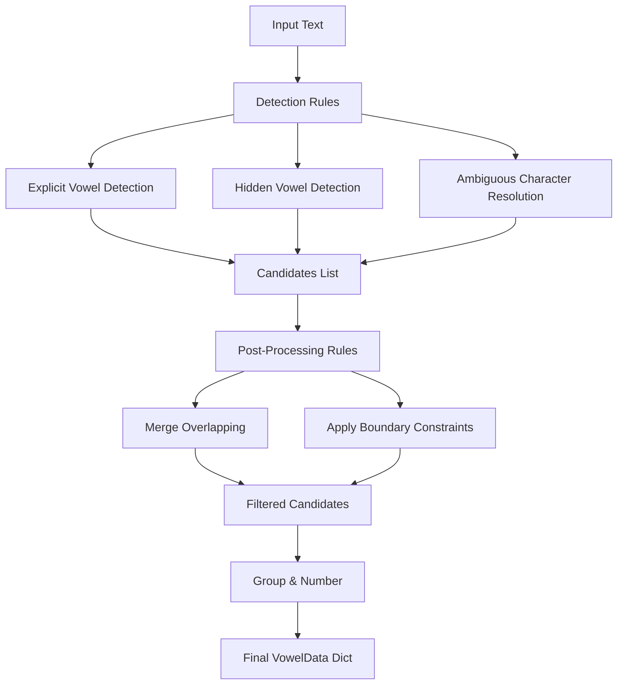

# Conjecture-Based Vowel Detection Algorithm

## Overview

The Conjecture-Based Vowel Detector is a modular, rule-based algorithm for detecting all vowels in Thai text, including hidden (implicit) vowels. It uses two fundamental linguistic axioms:

1. **Voraritskul Conjecture**: Every Thai syllable contains exactly one vowel pattern
2. **Two-Character Proximity Conjecture**: Every consonant has a vowel within 2 characters distance

By treating these conjectures as axioms, the algorithm achieves complete vowel coverage without machine learning or statistical models.

## Key Features

### 1. Complete Vowel Detection
- **Explicit vowels**: Patterns with visible vowel marks (า, ี, ู, เ, etc.)
- **Hidden vowels**: Inferred from proximity rule violations (คน → ค[โ-ะ]น)
- **Ambiguous characters**: Context-based resolution for ว, ย, อ

### 2. Modular Architecture
- **Rule Engine**: Extensible pipeline for adding custom rules
- **Three rule stages**: Pre-processing, Detection, Post-processing
- **Evidence tracking**: Each detection includes reasoning

### 3. Non-Destructive Processing
- Preserves all possible interpretations
- Uses first valid candidate found
- Never eliminates valid possibilities

## Installation and Setup

### Requirements
```python
# Python 3.7+
import json
import sys
import io
from typing import Dict, List, Tuple, Set, Optional, Callable
from dataclasses import dataclass, field
from enum import Enum
```

### Required Files
- `conjecture_based_vowel_detector.py` - Main algorithm
- `thai_vowels_tagged_9-21-2025-2-31-pm.json` - Pattern database with IDs

## Basic Usage

### Simple Detection

```python
from conjecture_based_vowel_detector import ConjectureBasedVowelDetector

# Initialize detector
detector = ConjectureBasedVowelDetector("thai_vowels_tagged_9-21-2025-2-31-pm.json")

# Detect vowels in text
text = "ประเทศไทย"
vowels = detector.find_vowels(text)

# Access results (1-based indexing)
for i in sorted(vowels.keys()):
    vowel_data = vowels[i]
    print(f"Vowel {i}:")
    print(f"  Pattern: {vowel_data.best_candidate.pattern}")
    print(f"  Type: {vowel_data.best_candidate.vowel_type.value}")
    print(f"  Position: {vowel_data.text_span}")
    print(f"  Evidence: {vowel_data.best_candidate.evidence}")
```

### Accessing Vowel Information

```python
# Get first vowel
first_vowel = vowels[1]

# Access best candidate
best = first_vowel.best_candidate
print(f"Pattern: {best.pattern}")
print(f"ID: {best.abbrev_id}")
print(f"Type: {best.vowel_type}")  # EXPLICIT, HIDDEN, or AMBIGUOUS

# Access all candidates for this position
for candidate in first_vowel.candidates:
    print(f"Alternative: {candidate.pattern} - {candidate.evidence}")

# Jump to text position
start, end = first_vowel.text_span
segment = text[start:end+1]
print(f"Text segment: {segment}")
```

### Working with Hidden Vowels

```python
text = "คน"  # Word with hidden vowel
vowels = detector.find_vowels(text)

for i in sorted(vowels.keys()):
    v = vowels[i]
    if v.best_candidate.vowel_type == VowelType.HIDDEN:
        print(f"Hidden vowel detected at position {v.text_span}")
        print(f"Evidence: {v.best_candidate.evidence}")
```

## Advanced Usage

### Adding Custom Rules

The algorithm supports adding custom rules at four different stages:

#### 1. Detection Rules
Add new methods for finding vowels:

```python
def detect_special_patterns(text):
    """Custom detection for special cases"""
    candidates = []

    # Your detection logic here
    # Must return List[VowelCandidate]

    return candidates

# Add to detector
detector.add_custom_rule(detect_special_patterns, "special_patterns", "detect")
```

#### 2. Post-Processing Rules
Filter or modify detected candidates:

```python
def filter_by_dictionary(text, candidates):
    """Remove candidates that create invalid words"""
    valid_candidates = []

    for candidate in candidates:
        # Your validation logic
        if is_valid_word(candidate):
            valid_candidates.append(candidate)

    return valid_candidates

detector.add_custom_rule(filter_by_dictionary, "dictionary_filter", "post")
```


### Customizing Character Sets

```python
# Access and modify character sets
detector.consonants.add('ฤ')  # Add special character
detector.vowel_marks.add('ๅ')  # Add vowel lengthener
detector.ambiguous_chars.add('ร')  # Mark as ambiguous
```

### Pattern Analysis

```python
def analyze_patterns(text):
    """Detailed pattern analysis"""
    detector = ConjectureBasedVowelDetector("patterns.json")
    vowels = detector.find_vowels(text)

    stats = {
        'total_vowels': len(vowels),
        'explicit': 0,
        'hidden': 0,
        'ambiguous': 0
    }

    for v_data in vowels.values():
        vowel_type = v_data.best_candidate.vowel_type
        if vowel_type == VowelType.EXPLICIT:
            stats['explicit'] += 1
        elif vowel_type == VowelType.HIDDEN:
            stats['hidden'] += 1
        else:
            stats['ambiguous'] += 1

    return stats
```

## Data Structures

### VowelData
The main return structure with 1-based indexing:

```python
@dataclass
class VowelData:
    vowel_number: int                    # 1, 2, 3... (1-based)
    candidates: List[VowelCandidate]     # All possible patterns
    best_candidate: VowelCandidate       # First valid pattern found
    text_span: Tuple[int, int]           # (start_pos, end_pos) in text
```

### VowelCandidate
Individual vowel pattern match:

```python
@dataclass
class VowelCandidate:
    vowel_type: VowelType                # EXPLICIT, HIDDEN, or AMBIGUOUS
    pattern: str                         # Pattern template (e.g., "xา")
    abbrev_id: str                       # Pattern ID (e.g., "a_l_o")
    start_pos: int                       # Start position in text
    end_pos: int                         # End position in text
    foundation_pos: Optional[int]        # Position of 'x' (consonant)
    final_pos: Optional[int]             # Position of 'f' (final consonant)
    evidence: List[str]                  # Reasoning for this detection
```

### VowelType
Enumeration of vowel types:

```python
class VowelType(Enum):
    EXPLICIT = "explicit"      # Visible vowel mark
    HIDDEN = "hidden"          # Inferred from proximity rule
    AMBIGUOUS = "ambiguous"    # Could be either (ว, ย, อ)
```

## Algorithm Flow



## Example Output

### Text: "สตรี" (woman)
```
Vowel 1:
  Pattern: HIDDEN_xf
  Type: hidden
  Position: (0, 0)
  Evidence: ["No vowel within 2 chars of consonant 'ส' at 0"]

Vowel 2:
  Pattern: xี
  Type: explicit
  Position: (2, 3)
  Evidence: ["Explicit vowel mark 'ี' at position 3"]
```

### Text: "ประเทศไทย" (Thailand)
```
Vowel 1:
  Pattern: xะ
  Type: explicit
  Position: (1, 2)

Vowel 2:
  Pattern: เxf
  Type: explicit
  Position: (3, 5)

Vowel 3:
  Pattern: ไxย
  Type: explicit
  Position: (6, 8)
```

## Performance Considerations

### Time Complexity
- **Explicit vowel detection**: O(n × p) where n = text length, p = patterns with vowel
- **Hidden vowel detection**: O(n) single pass with 5-character window
- **Total**: O(n × p) with small p due to pattern indexing

### Space Complexity
- O(n × c) where c = average candidates per position
- Typically c < 5, so effectively O(n)

### Optimization Tips
1. Pre-build pattern indices for faster lookup
2. Use character type checking before pattern matching
3. Cache frequently used patterns
4. Apply most restrictive rules first

## Extending the Algorithm

### Adding New Vowel Types

```python
class VowelType(Enum):
    EXPLICIT = "explicit"
    HIDDEN = "hidden"
    AMBIGUOUS = "ambiguous"
    COMPOUND = "compound"  # New type for compound vowels

# Add detection rule for compound vowels
def detect_compound_vowels(text):
    # Detection logic
    pass

detector.add_custom_rule(detect_compound_vowels, "compound_detection", "detect")
```

### Integration with Syllable Segmentation

```python
def segment_syllables(text):
    """Use vowel anchors for syllable segmentation"""
    detector = ConjectureBasedVowelDetector("patterns.json")
    vowels = detector.find_vowels(text)

    syllables = []
    for i in range(1, len(vowels) + 1):
        current = vowels[i]
        next_vowel = vowels.get(i + 1)

        # Apply boundary rules based on vowel positions
        # Implementation of Voraritskul Conjecture

        syllables.append(syllable)

    return syllables
```

## Troubleshooting

### Common Issues

1. **Missing vowels**: Check if hidden vowel detection is working
2. **Incorrect pattern selection**: Add domain-specific filtering rules
3. **Overlapping candidates**: Adjust post-processing merge logic
4. **Wrong pattern selection**: Adjust rule ordering

### Debug Mode

```python
# Enable verbose output
for v_data in vowels.values():
    print(f"Vowel {v_data.vowel_number}:")
    print(f"  Candidates: {len(v_data.candidates)}")
    for c in v_data.candidates:
        print(f"    {c.pattern} - {c.evidence}")
```

## Future Enhancements

1. **Frequency-based ordering**: Use corpus statistics for pattern likelihood
2. **Context-aware detection**: Consider surrounding syllables
3. **Tone mark handling**: Special rules for tone mark placement
4. **Cluster detection**: Advanced consonant cluster analysis
5. **Dictionary validation**: Verify against known Thai words

## License and Citation

This algorithm is based on the Voraritskul Conjecture for Thai Segmentation and the Two-Character Proximity Conjecture. When using this algorithm in research or applications, please cite:

```
Voraritskul Conjecture for Thai Segmentation (2025)
Two-Character Proximity Conjecture for Hidden Vowel Detection (2025)
```

---

*Last Updated: September 26, 2025*